

	

		
	

	<h1 align="center">do it.</h1>

do it. - is a free and open source ToDo app for Android 6.0 and above.

## Features 
Features include:
* Authentication with Google or GitHub.
* Creating Kanban boards
* Creating new tasks (fields: **name**, description, due date, priority, assign to)
* Creating new sections
* Adding other users to the Kanban board with their email.
* Changing tasks' info
* Moving tasks from one section to another
* Changing theme (light or dark)
* Deleting tasks
* Deleting Kanban board

## Download
Get the app from [releases page](https://github.com/raisenup/do_it/releases).

## Screenshots

### Light theme
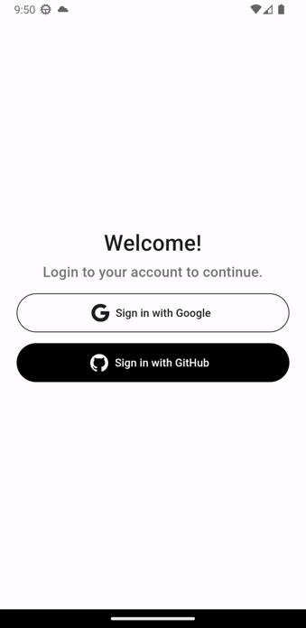</img> 
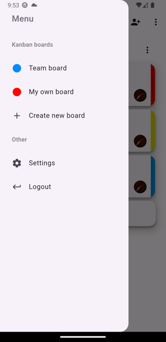</img> 
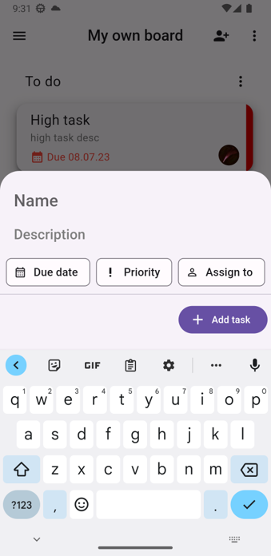</img> 
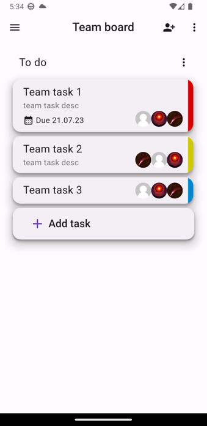</img> 
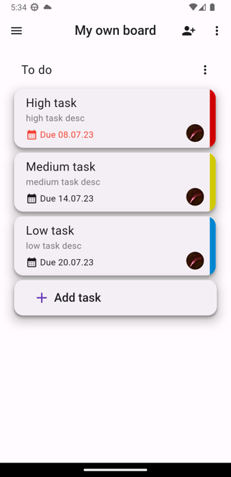</img> 
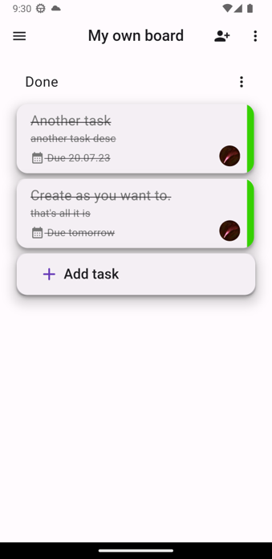</img>

### Dark theme
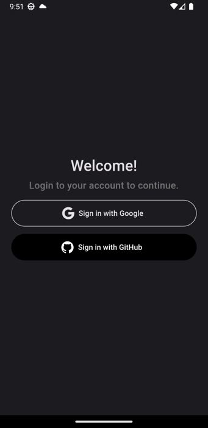</img> 
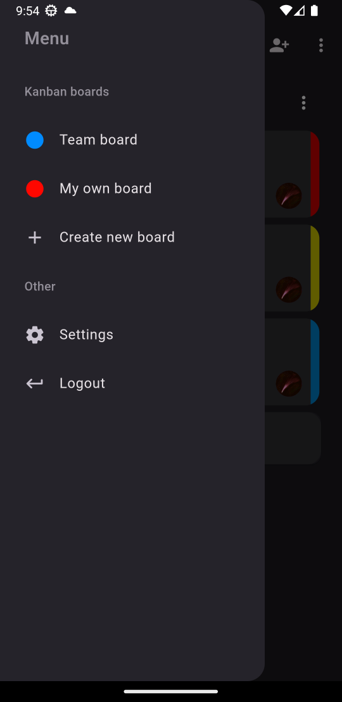</img> 
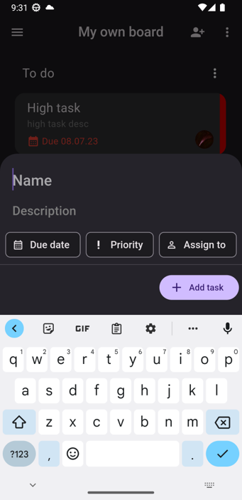</img> 
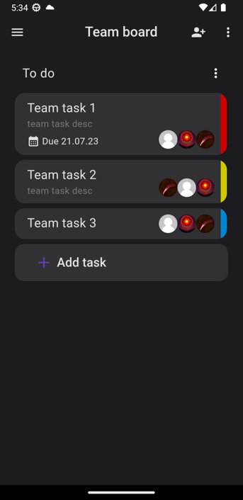</img> 
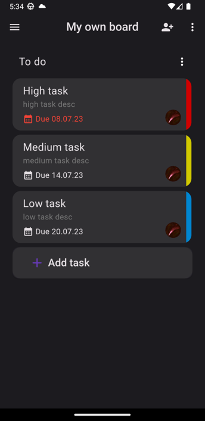</img> 
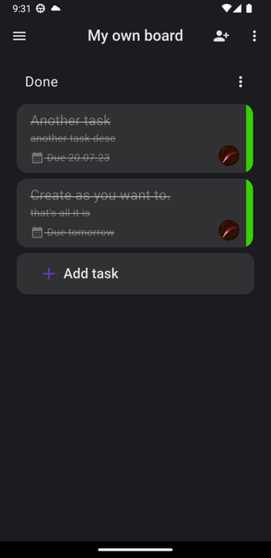</img> 
